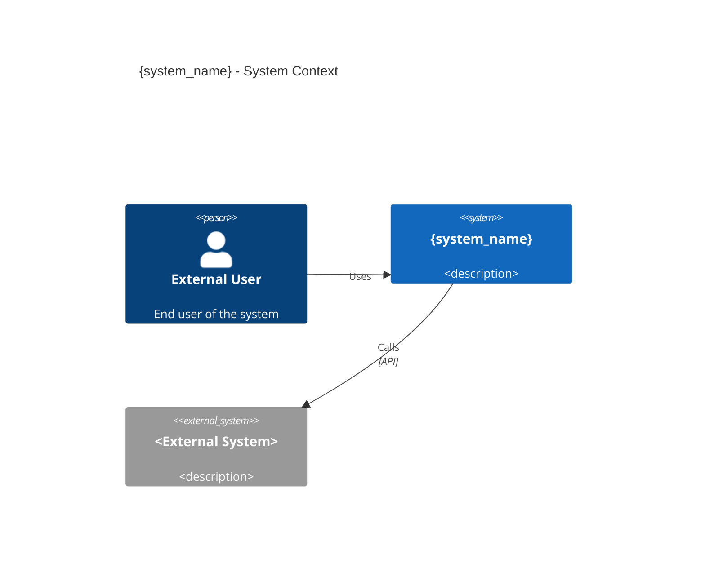
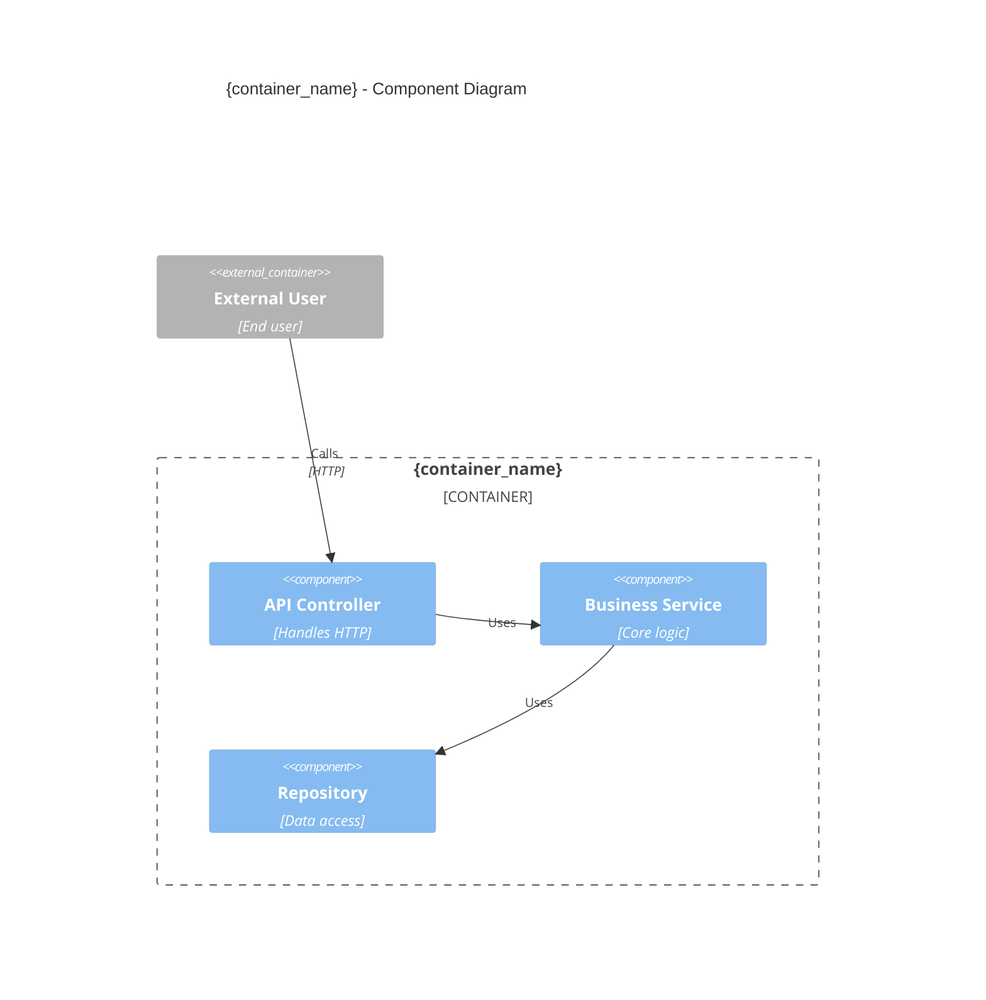

# Luke Reference

Load on demand — not needed on every invocation. Luke's steps direct when to read each section.

---

## Migration Script

`$UB luke-repo-init` handles all deterministic scaffolding for the repo's `.claude/` directory. Luke calls it once in S5 — it never inline-creates these files one by one.

**IMPORTANT:** This script creates files in `<repo-root>/.claude/` — the repo's local Claude config. It has nothing to do with `~/.claude/` (the user's global Claude installation). These must never be conflated.

### Script location and registration

- **Script path:** `<BASE_DIR>/tools/luke-repo-init.py`
- **Invocation:** `bash ~/.claude/hooks/ub.sh luke-repo-init <repo-root> --stack <dotnet|node|python|unknown>`
- **Register in:** `<BASE_DIR>/tools/REGISTRY.md` before first use

### What the script creates

```
<repo-root>/
└── .claude/
    ├── .gitignore              (tracks team files, excludes personal/session)
    ├── settings.json           (permissions + staleness hook — merged if exists)
    ├── hooks/
    │   ├── luke-staleness-check.py
    │   └── luke-edit-staleness-check.py
    ├── skills/                 (directory only — Luke writes luke.md content after)
    └── memory/                 (directory only — tracked in git, populated over time)
```

### What the script does NOT create

- `CLAUDE.md` — Luke writes this (content requires judgment)
- `.claude/skills/luke/SKILL.md` — Luke writes this (content is repo-specific)
- `aidlc-docs/` — created during S4 (survey artifacts)

### Script behaviour

1. **Check for existing `.claude/`** — if it exists, merge rather than overwrite. Never remove files not in the Luke scaffold.
2. **Create directories** — `.claude/`, `.claude/hooks/`, `.claude/skills/`, `.claude/memory/`
3. **Write `.claude/.gitignore`** — from the template in § Git Tracking
4. **Write/merge `.claude/settings.json`** — stack-specific permissions + staleness hook. If file exists, merge `permissions.allow` and `hooks.PreToolUse` arrays, preserve all other fields.
5. **Write `.claude/hooks/luke-staleness-check.py` and `luke-edit-staleness-check.py`** — staleness hook scripts (Python, invoked via `py.sh`)
6. **Check root `.gitignore`** — grep for `.claude` blanket exclusion. If found, report it to Luke (who tells the user and asks to fix it). Script does not auto-modify the root `.gitignore`.
7. **Report** — print a summary of what was created/merged/skipped to stdout

### Stack-specific `settings.json` permissions

| Stack | Extra `permissions.allow` entries |
|-------|----------------------------------|
| `dotnet` | `"Bash(dotnet *)"`, `"Bash(git *)"` |
| `node` | `"Bash(npm *)"`, `"Bash(npx *)"`, `"Bash(git *)"` |
| `python` | `"Bash(python *)"`, `"Bash(pip *)"`, `"Bash(git *)"` |
| `unknown` | `"Bash(git *)"` only |

All stacks get: `"Read"`, `"Glob"`, `"Grep"`, `"Skill(luke)"`, `"mcp__plugin_context-mode_context-mode__ctx_search"`, `"mcp__plugin_context-mode_context-mode__ctx_batch_execute"`, `"mcp__plugin_context-mode_context-mode__ctx_execute"`

### Staleness hook scripts

Two hooks. Both are Python scripts generated by `$UB luke-repo-init` into `.claude/hooks/`. Invoked via `bash ~/.claude/hooks/py.sh .claude/hooks/<script>.py` — consistent with all other pipeline tooling. No Node/npm dependency.

**`luke-staleness-check.py`** — PreToolUse on Skill: overall survey freshness (3 signals) before any `/luke` invocation.

```python
#!/usr/bin/env python3
# PreToolUse on Skill — 3-signal overall survey freshness check.
import os, re, subprocess, sys
from datetime import date, datetime
from pathlib import Path

repo_root = Path(os.environ.get("REPO_ROOT") or os.environ.get("CLAUDE_PROJECT_ROOT") or os.getcwd())
meta_path = repo_root / "aidlc-docs" / "inception" / "reverse-engineering" / ".survey-meta.md"

if not meta_path.exists():
    sys.stderr.write("Luke: No survey found for this repo. Run /luke to survey and initialise.\n"); sys.exit(0)

content = meta_path.read_text(encoding="utf-8")
cm = re.search(r"\*\*Commit:\*\*\s+([a-f0-9]+)", content)
dm = re.search(r"\*\*Date:\*\*\s+(.+)", content)
if not cm: sys.exit(0)

try:
    behind = int(subprocess.check_output(
        ["git", "-C", str(repo_root), "rev-list", "--count", f"{cm.group(1).strip()}..HEAD"],
        stderr=subprocess.DEVNULL, text=True).strip())
    days = None
    if dm:
        for fmt in ("%Y-%m-%dT%H:%M:%SZ", "%Y-%m-%dT%H:%M:%S", "%Y-%m-%d"):
            try: days = (date.today() - datetime.strptime(dm.group(1).strip(), fmt).date()).days; break
            except ValueError: continue
    d = str(days) if days is not None else "?"
    if behind > 50 or (days and days > 90):
        sys.stderr.write(f"Luke: Survey very stale — {behind} commits, {d} days old. Run /luke to refresh.\n")
    elif behind > 10 or (days and days > 30):
        sys.stderr.write(f"Luke: Survey is {behind} commits behind ({d} days old). Consider refreshing with /luke.\n")
except Exception: pass
```

**`luke-edit-staleness-check.py`** — PostToolUse on Edit/Write (background): checks if the edited file matches any artifact's `relevant_paths`, surfaces a note if that area is stale.

```python
#!/usr/bin/env python3
# PostToolUse on Edit|Write — per-file targeted staleness check. Runs in background.
import fnmatch, os, re, subprocess, sys
from pathlib import Path

repo_root = Path(os.environ.get("REPO_ROOT") or os.environ.get("CLAUDE_PROJECT_ROOT") or os.getcwd())
artifacts_dir = repo_root / "aidlc-docs" / "inception" / "reverse-engineering"
edited_file = os.environ.get("TOOL_INPUT_FILE_PATH") or os.environ.get("TOOL_INPUT_PATH") or ""

if not edited_file or not artifacts_dir.exists(): sys.exit(0)
try: rel_edited = Path(edited_file).relative_to(repo_root).as_posix()
except ValueError: sys.exit(0)

try:
    for md in sorted(artifacts_dir.glob("*.md")):
        if md.name.startswith("."): continue
        text = md.read_text(encoding="utf-8")
        hm = re.search(r"<!--(.*?)-->", text, re.DOTALL)
        if not hm: continue
        block = hm.group(1)
        cm = re.search(r"commit:\s*([a-f0-9]+)", block)
        paths = [m.group(1).strip().strip('"').strip("'")
                 for m in re.finditer(r'-\s+["\']?([^"\'\\n]+)["\']?', block)]
        if not cm or not paths: continue
        if not any(fnmatch.fnmatch(rel_edited, p) for p in paths): continue
        behind = int(subprocess.check_output(
            ["git", "-C", str(repo_root), "rev-list", "--count",
             f"{cm.group(1).strip()}..HEAD", "--"] + paths,
            stderr=subprocess.DEVNULL, text=True).strip())
        if behind >= 5:
            sys.stderr.write(f"Luke: {md.name} may be stale — {behind} commits have touched "
                             f"this area since the last survey. Run /luke to refresh.\n")
        break
except Exception: pass
```

---

## Git Tracking

### What belongs in version control

| Path | Track | Reason |
|------|-------|--------|
| `.claude/CLAUDE.md` | Yes | Project instructions — every developer needs them |
| `.claude/skills/*.md` | Yes | Repo skills including local Luke — ships with repo |
| `.claude/settings.json` | Yes | Shared permissions + hooks |
| `.claude/hooks/*.py` | Yes | Hook scripts Luke generates (staleness check, etc.) |
| `.claude/memory/` | Yes | Repo-specific knowledge Luke accumulates — conventions, decisions, gotchas. Shared team intelligence. |
| `aidlc-docs/` | Yes | All survey artifacts — the entire point of Luke |
| `.claude/settings.local.json` | No | Personal overrides: model, theme, personal tokens — never shared |
| `.claude/.session*` | No | Transient session state — meaningless outside the session |
| `.claude/backups/` | No | Local safety copies — not for version control |
| `.claude/codebase/` | No | Legacy Lucius directory (migrated out by Luke; deleted) |
| `.claude/plans/` | Ask user | WIP planning for repo changes — per-developer in-progress work. Luke asks whether to track before deciding. |

### `.claude/.gitignore` template

Write this file to `<repo>/.claude/.gitignore`:

```gitignore
# Personal overrides — never shared
settings.local.json

# Transient session state — meaningless outside the session
.session*

# Local safety backups — not for version control
backups/

# Legacy Lucius artifacts (migrated to aidlc-docs/ by Luke)
codebase/

# Transient working files
*.tmp
*.bak

# plans/ — ask the user before deciding (see Git Tracking table)
# memory/ is intentionally tracked — repo-specific knowledge shared across the team
```

### Root `.gitignore` check

Before writing anything, grep the repo's root `.gitignore` for `.claude`:

```
Grep pattern: \.claude in <repo-root>/.gitignore
```

| Finding | Action |
|---------|--------|
| `.claude` or `.claude/` excluded | Add negation: `!.claude/` and `!.claude/**` — or replace with specific exclusions that match the `.claude/.gitignore` above |
| Not mentioned | No action needed — `.claude/` will be tracked normally |
| Already has fine-grained exclusions matching the table above | No action needed |

Show the user if any root `.gitignore` change is needed and confirm before writing.

### `.sln` / `.csproj` — never modify

`.claude/` is tooling configuration, not a .NET project. Do not add it to the solution file or any `.csproj`. It belongs alongside `.github/`, `.vscode/`, `.editorconfig` — invisible to the build system, tracked by git.

---

## Settings Template

Luke generates or merges `.claude/settings.json` in the repo during S5. Heavy infrastructure (hooks, plugin registrations, env vars) lives in global user settings — do NOT duplicate it per-repo. Only write what is genuinely repo-scoped.

### What to include

| Field | Include? | Why |
|-------|----------|-----|
| `$schema` | Always | IDE validation and autocomplete |
| `permissions.allow` — stack commands | Yes | Derived from detected tech stack — avoids prompts for common operations |
| `permissions.allow` — context-mode MCP | Yes | Local Luke queries use `ctx_search`/`ctx_batch_execute` |
| `permissions.allow` — local skills | Yes | `Skill(luke)` should not prompt |
| `hooks` — Luke staleness PreToolUse (Skill) | Yes | Overall freshness warning before any `/luke` invocation |
| `hooks` — Luke staleness PostToolUse (Edit/Write) | Yes | Per-file: surfaces note when edited file matches a stale artifact's `relevant_paths` |
| `attribution` | User choice | Only for open-source repos — ask user before including |
| `hooks` — bash-guard, write-guard, cred-gate | No | Already in global settings — don't duplicate |
| `enabledPlugins` | No | Plugin registration is global |
| `env` — AWS credentials, model IDs | No | Global settings — never per-repo |

### Tech stack detection → permissions

| Detected stack | Add to permissions.allow |
|---------------|--------------------------|
| .NET / C# | `"Bash(dotnet *)"`, `"Bash(git *)"` |
| Node.js / TypeScript | `"Bash(npm *)"`, `"Bash(npx *)"`, `"Bash(git *)"` |
| Python | `"Bash(python *)"`, `"Bash(pip *)"`, `"Bash(git *)"` |
| Any | `"Read"`, `"Glob"`, `"Grep"` — these are always safe |

### Luke staleness hooks

Two hooks — both generated by `$UB luke-repo-init`:

| Hook | Trigger | What it does |
|------|---------|-------------|
| `PreToolUse` on `Skill` | Before any `/luke` invocation | Overall: 3-signal check (commits, days, lines). Warns if stale before Luke runs. |
| `PostToolUse` on `Edit\|Write` | After any file edit | Per-file: checks if edited path matches any artifact's `relevant_paths`. If stale area, surfaces a background note. Non-blocking. |

Scripts are in `.claude/hooks/` — see § Staleness hook scripts for full source.

### Base template

```json
{
  "$schema": "https://json.schemastore.org/claude-code-settings.json",
  "permissions": {
    "allow": [
      "Read",
      "Glob",
      "Grep",
      "Skill(luke)",
      "mcp__plugin_context-mode_context-mode__ctx_search",
      "mcp__plugin_context-mode_context-mode__ctx_batch_execute",
      "mcp__plugin_context-mode_context-mode__ctx_execute",
      "<STACK_SPECIFIC_PERMISSIONS>"
    ]
  },
  "hooks": {
    "PreToolUse": [
      {
        "matcher": "Skill",
        "hooks": [
          {
            "type": "command",
            "command": "bash ~/.claude/hooks/py.sh .claude/hooks/luke-staleness-check.py"
          }
        ]
      }
    ],
    "PostToolUse": [
      {
        "matcher": "Edit|Write",
        "hooks": [
          {
            "type": "command",
            "command": "bash ~/.claude/hooks/py.sh .claude/hooks/luke-edit-staleness-check.py",
            "runInBackground": true
          }
        ]
      }
    ]
  }
}
```

### Merging with existing settings.json

If a `settings.json` already exists in `.claude/`:
1. Read the existing file
2. Merge `permissions.allow` — append Luke's entries, do not remove existing ones
3. Merge `hooks.PreToolUse` and `hooks.PostToolUse` — append Luke's hooks, do not remove existing ones
4. Preserve all other fields unchanged
5. Show the diff to the user before writing

Never replace a `settings.json` wholesale — always merge.

---

## Survey Scripts

### Script inventory

| Script | What it finds | Feeds into | When |
|--------|---------------|------------|------|
| `$UB pre-scan <repo>` | Project layout, packages, configs, test groups, static state, base classes, env vars, **HTTP endpoints** | All 3 cluster subagent prompts (mandatory) | Before subagent launch |
| `$UB c4-extract <repo>` | C4 skeleton: Context (users, external systems), Containers (services, DBs, queues), Components (classes, namespaces), Dependencies | C4 JSON skeleton | After pre-scan, before subagents |
| `$UB c4-render <c4.json> --output <file.html>` | Renders self-contained HTML C4 diagrams with SVG, legends, and interactivity | C4 HTML diagram | After c4-extract, during artifact writing |
| `$UB c4-navigator <dir>` | Generates index.md navigation hub linking to all artifacts | index.md | After all artifacts written |
| `$UB check-unused-deps <repo>` | Unused NuGet/npm packages | `findings.md` → Tech Debt | Parallel with subagents |
| `$UB find-helper-duplication <repo> --json` | Local methods bypassing shared helpers | `findings.md` → Violations | Parallel with subagents |
| `$UB map-token-usage <repo> --json` | Token-to-endpoint-to-test-group mapping | `patterns.md` → Auth section | Parallel with subagents |
| `$UB check-survey-staleness <repo>` | Commit distance + days old + lines changed per artifact | Query Mode + Local Skill startup | Before answering questions |
| `$UB check-survey-staleness <repo> --artifact <name.md>` | Per-artifact targeted staleness | Targeted re-survey decision | When working in a specific area |

**Key:** pre-scan now includes HTTP endpoint enumeration (all `[HttpGet]`/`[Route]`/`app.MapXxx` attributes). Agent 2 reads the table — it does NOT re-scan for routes.

**C4 Workflow:**
1. Run `pre-scan` first (mandatory for all subagents)
2. Run `c4-extract` after pre-scan (produces `c4-skeleton.json`)
3. Run `c4-render` on the JSON output (produces self-contained HTML with SVG diagrams)
4. Launch subagents (with pre-scan + C4 skeleton embedded)
5. Subagents enrich C4 skeleton → write final C4 artifacts
6. Run `c4-navigator` to generate index.md navigation hub

Script results are deterministic and authoritative — merge into artifacts without second-guessing. Do not reference script names in artifact files (see § Artifact Hygiene).

Run pre-scan first. Wait for its output. Then run c4-extract and c4-render. Then launch the 3 cluster agents (with pre-scan + C4 skeleton embedded) and the 3 parallel scripts simultaneously. After all artifacts are written, run c4-navigator to generate the index.md navigation hub.

---

## Survey Subagents

Each subagent receives: pre-scan output scoped to its cluster + the cluster's structured return template embedded verbatim. Subagent prompts include the constraint block first.

### Constraint block (embed verbatim in every subagent prompt)

```
**Subagent constraints — read these first:**
- Do NOT create, update, or delete any files in `memory/` or `MEMORY.md`. Return findings only.
- All inputs are provided inline — do not read the parent skill file.
- Multi-project: tag every finding with which project it belongs to (from directory/csproj/package.json).
- Return ONLY the LUKE_CLUSTER_RESULT block. No preamble. No explanation outside the block.
- Fill every field. Use "none found" if genuinely absent. Never leave a field empty.
```

### Agent 1 — Business + Stack

**Return template (embed verbatim in prompt):**
```
LUKE_CLUSTER_RESULT
cluster: business-stack
overview: |
  <2-3 sentences — what this system does in business terms. What problem it solves, who uses it, what it produces. A product manager should recognise this.>
tech_stack: |
  <table or bullet list: language, framework, runtime, version. Include test framework.>
entry_points: |
  <list: each executable/API host with its startup file path and how it's invoked>
key_dependencies: |
  <external services, databases, queues, third-party APIs called — each with: name, purpose, how it's called>
build_commands: |
  <exact commands: build, test all, test filtered — copy from code, not guessed>
why_this_structure: |
  <why is the project structured this way — [ASSUMED] if inferred from code patterns>
additional_findings: <cross-cutting risks, surprises, or "none">
END_LUKE_CLUSTER
```

**Full prompt:**
```
{constraint block}

You have a pre-scan of this repo below. DON'T re-discover file structure — read the files the pre-scan identified to find actual values.

Specifically find:
- Business purpose: what does this system do, for whom, what outcome does it produce
- Tech stack: read csproj/package.json/pyproject.toml for actual versions — don't estimate
- Entry points: trace startup from the files listed in Pre-Scan > Entry Points
- External dependencies: read code for actual service calls (HTTP clients, SDK clients, queue consumers)
- Build commands: read README, Makefile, or runsettings for exact commands

<PRE_SCAN>
{pre-scan --markdown output — scoped to: Projects, Config Files, Environments, Entry Points sections}
</PRE_SCAN>

Return the LUKE_CLUSTER_RESULT block using the template above. Fill every field.
```

### Agent 2 — Structure + API

**Return template (embed verbatim in prompt):**
```
LUKE_CLUSTER_RESULT
cluster: structure-api
component_map: |
  <table: Component | Project | Type | Responsibility | Key files>
  <For each: what it owns, why it's a separate component, what it does NOT do>
service_boundaries: |
  <what crosses a boundary (HTTP, message, shared DB) vs what's internal — explicit list>
  <any boundary violations: circular deps, shared mutable state across components>
api_contracts: |
  <table: Method | Path | Auth | Request shape | Response shape | Status codes>
  NOTE: use the HTTP Endpoints table from pre-scan as your route list.
  Read the controller files to fill in request/response shapes and auth.
  Do not re-discover routes — only add shape/auth/status detail.
data_models: |
  <table: Model | Used by | Key fields | Validation | Notes>
  <include: entities, DTOs, request/response objects, any ORM mapping notes>
boundary_violations: |
  <specific instances of: circular deps, shared state across boundaries, tight coupling — or "none found">
additional_findings: <cross-cutting risks, surprises, anti-pattern candidates, or "none">
END_LUKE_CLUSTER
```

**Full prompt:**
```
{constraint block}

You have a pre-scan of this repo below. The HTTP endpoints table is authoritative — use it as your route list and read the referenced files to add shapes and auth detail.

Specifically find:
- Component ownership: what each project/module owns, why it exists as a separate unit
- Boundaries: what data or calls cross a component boundary vs what stays internal
- API shapes: for each endpoint in the pre-scan table, read the controller file and fill in request body, response body, auth type, and status codes
- Data models: read model/DTO/entity files for field names, types, validation, and ORM notes

<PRE_SCAN>
{pre-scan --markdown output — scoped to: Projects, HTTP Endpoints, Static State, Base Classes sections}
</PRE_SCAN>

Return the LUKE_CLUSTER_RESULT block using the template above. Fill every field.
```

### Agent 3 — Quality + Ops

**Return template (embed verbatim in prompt):**
```
LUKE_CLUSTER_RESULT
cluster: quality-ops
test_framework: |
  <framework name, version, test runner, how tests are grouped/filtered>
  <grouping/trait system: what values exist, what each means, how to filter>
credential_chain: |
  <ordered list: source 1 → source 2 → fallback → what happens if all fail>
  <traced from code — not from docs. Include the exact env var names and config keys.>
  <what happens if init fails: null ref, exception, misleading error?>
how_to_add_test: |
  <directory pattern: where the file goes (exact path template)>
  <base class: what to inherit, why — what cross-cutting concerns does it provide>
  <shared helpers: RequestGenerator, ResponseHandler, AssertHelper, etc — what each does and why you must use them instead of raw HttpClient>
  <trait attribute: exact value for a standard new test>
  <naming convention: exact format with example>
  <concrete example: "For a new GET /widgets test: create PPGTests/.../Widgets_GET_Tests.cs, inherit X, add [Trait(...)]">
build_system: |
  <exact commands: build, test all, test filtered by group>
  <group ordering: exact sequence and WHY — what breaks if you run out of order>
  <common first-run mistakes: what fails and how to fix it>
additional_findings: <cross-cutting risks, surprises, or "none">
END_LUKE_CLUSTER
```

**Full prompt:**
```
{constraint block}

You have a pre-scan of this repo below. Read the actual test files, config files, base classes, and build setup.

Specifically find:
- Test framework: read the runsettings file and test project csproj for framework/runner versions
- Credential chain: trace the actual code path from app startup to credential resolution — read the credential helper and fixture classes
- Static state: the pre-scan lists static members — read those classes to understand what breaks if tests run in parallel
- How to add a test: read one existing test file end to end, then read the base class to understand what it provides
- Build and group ordering: read the README or any CI pipeline file for the intended run order and its rationale

<PRE_SCAN>
{pre-scan --markdown output — scoped to: Test Groups, Static State, Base Classes, Fixture Registrations, Environment Variable Reads sections}
</PRE_SCAN>

Return the LUKE_CLUSTER_RESULT block using the template above. Fill every field.
```

---

## Subagent Return Formats

The cluster-specific templates above are the authoritative return formats — embed each verbatim in the relevant agent prompt. For the Luke context query subagent (`agents/luke.md`), the return format is `LUKE_CONTEXT_RESULT` — see that file.

---

## S3 Quality Gates

Before finalising `findings.md` and `anti-patterns.md`, verify each finding against these gates:

### Finding classification

| Category | Rule |
|----------|------|
| Violation | Code breaks the repo's OWN established patterns or creates unsafe defaults. Missing safety guardrail (e.g., defaulting to production with no env var) = violation, not gotcha. |
| Recommendation | Better approach than current — pattern drift, outdated area |
| Tech Debt | Dead code, unused dependencies, tight coupling, missing tests adjacent to change, test workarounds that are the COST of a design choice |
| Gotcha | Non-obvious but not dangerous. Surprises a developer but won't cause production impact. If it could cause production impact → violation. |
| Anti-Pattern | Pattern found in this codebase that violates conventions or creates risk — documented in anti-patterns.md so AI/humans know NOT to replicate it. Must include: evidence (file path), why it's wrong, what to do instead. |

### Per-finding verification checklist

- [ ] For "breaks/fails" claims: verified actual failure path, not assumed from structure
- [ ] For tech debt: the thing flagged is actually changeable (e.g., Roslyn analyzers must target netstandard2.0 — that's a constraint, not debt)
- [ ] For coverage/tooling: meaningful for this project type? (integration tests against remote APIs → coverage measures harness, not system under test)
- [ ] For duplication findings: does the local code bypass cross-cutting concerns in the shared path? If yes → violation. If no → recommendation at most.
- [ ] Classification is correct: violations = breaks own patterns, recommendations = improvements, gotchas = non-obvious but not dangerous
- [ ] Multi-project repos: every finding has `**Project:** <name> (<type>)` line
- [ ] Cross-cutting connections checked — no isolated finding when it has downstream consequences
- [ ] NOT a framework standard: standard framework/protocol behaviour is not a finding. Only flag if the REPO'S USAGE of the standard creates a genuine trap.
- [ ] NOT self-documenting: `environmentOverride` doing exactly what its name says is not a finding.
- [ ] HIGH findings include `**Operational Impact:**` and `**Mitigation Sketch:**` fields

### Cross-cutting pass

After drafting all findings:
- Trace cause chains: if static state forces a test workaround, connect them — don't scatter
- Check default mismatches: when you find a default value in one subsystem, check whether tests/CI/scripts assume the same default
- Check dependency usage: for every dependency listed, verify it's actually imported/used

### Artifact hygiene

Never reference internal tool or script names in any artifact file (`find-helper-duplication.py`, `check-unused-deps.py`, `map-token-usage.py`, `pre-scan.py`, etc.). Use neutral phrasing: "static analysis identified...", "dependency analysis confirmed...", "token mapping shows...".

---

## JSON Sidecars

Every `.md` artifact gets a companion `.json` file in the same directory. The JSON sidecar makes artifacts consumable by AI systems without markdown parsing.

### Schema (per-sidecar)

```json
{
  "artifact": "<filename>.md",
  "generated_at": "<ISO 8601 date>",
  "commit": "<HEAD commit hash>",
  "repo": "<repo name>",
  "sections": [
    {
      "heading": "<heading text>",
      "content": "<section text — stripped of markdown formatting>",
      "type": "<overview|table|list|code|prose>"
    }
  ],
  "summary": "<1-2 sentence summary of what this artifact covers>",
  "primary_consumers": ["<skill names that read this>"]
}
```

Write JSON sidecars after writing each `.md` file. Parse the markdown sections by heading level 2 (`##`). Strip markdown formatting from content for the `content` field.

---

## change_triggers Table

The `change_triggers` section in `.survey-meta.md` maps key files to which survey artifacts go stale when that file changes. Allows targeted re-survey instead of full re-survey.

### Template for .survey-meta.md

```markdown
## Survey Metadata
**Commit:** <HEAD commit hash>
**Date:** <ISO 8601 date>
**Surveyed by:** Luke
**Focus areas:** <all | specific areas if scoped survey>
**Files produced:**
- business-overview.md
- technology-stack.md
- dependencies.md
- architecture.md
- code-structure.md
- api-documentation.md
- component-inventory.md
- test-infrastructure.md
- findings.md
- anti-patterns.md
- [+ conditional artifacts if written]

## Staleness Thresholds
- <10 commits behind: use as-is, note the gap
- 10-50 commits behind: flag to user, offer Luke refresh
- >50 commits behind: treat as absent — too stale to trust

## Change Triggers
| File pattern | Artifacts affected | Trigger reason |
|-------------|-------------------|----------------|
| `*.csproj` | technology-stack.md, dependencies.md | Package/dependency changes |
| `*Controller*.cs` | api-documentation.md, architecture.md | Endpoint changes |
| `**/Migrations/**` | domain-model.md, code-structure.md | Schema changes |
| `appsettings*.json` | overview.md, test-infrastructure.md | Config/env changes |
| `*Test*.cs` | test-infrastructure.md | Test pattern changes |
| `**/Models/**` | domain-model.md, code-structure.md | Data model changes |
| `**/Services/**` | architecture.md, component-inventory.md | Service boundary changes |
| `CLAUDE.md` | — (Luke owns CLAUDE.md update, not a trigger) | — |
```

Customise the file patterns based on actual repo structure observed during S2/S3.

---

## Artifact Templates

All files written to `<repo-root>/aidlc-docs/inception/reverse-engineering/`.

### Standard metadata header (prepend to EVERY artifact)

Every artifact begins with this header block. It lets Claude assess staleness for the specific area being worked in without reading the whole file.

```markdown
<!--
surveyed_at: <ISO 8601 datetime>
commit: <HEAD commit hash at survey time>
relevant_paths:
  - <glob or directory pattern that would make this artifact stale if changed>
  - <e.g. src/PaymentService/**, **/Controllers/**, **/Migrations/**>
summary: <one sentence — what this artifact covers>
-->
```

**`relevant_paths`** is the key field. It maps this artifact to the parts of the codebase it describes. When Claude is working on a file, it checks whether that file matches any artifact's `relevant_paths` and compares the artifact's `commit` against the current HEAD to see how many changes have landed in that area since the survey. If significant changes have landed, Claude surfaces a note: *"The api-documentation.md artifact was last surveyed at commit a3f1c9 — N commits have touched controllers since then. It may not reflect current contracts. Run `/luke` to refresh."*

**Per-artifact `relevant_paths` values** (use these when writing):

| Artifact | relevant_paths |
|----------|---------------|
| `overview.md` | `**/*.csproj`, `**/appsettings*.json`, `Program.cs`, `Startup.cs` |
| `architecture.md` | `**/Services/**`, `**/Handlers/**`, `**/Infrastructure/**` |
| `api-documentation.md` | `**/*Controller*.cs`, `**/Endpoints/**`, `**/Routes/**` |
| `patterns.md` | `**/Services/**`, `**/Middleware/**`, `**/Extensions/**` |
| `domain-model.md` | `**/Models/**`, `**/Entities/**`, `**/Migrations/**` |
| `dependencies.md` | `**/*.csproj`, `**/package.json`, `**/requirements.txt` |
| `component-inventory.md` | `**/Services/**`, `**/Handlers/**`, `**/Repositories/**` |
| `code-structure.md` | `**/*.cs` (broad — any structural change) |
| `test-infrastructure.md` | `**/*Test*.cs`, `**/*Tests.cs`, `**/integration.runsettings` |
| `findings.md` | `**/*.cs` (broad — any change may invalidate findings) |
| `anti-patterns.md` | `**/*.cs` (broad) |
| `business-overview.md` | `**/Services/**`, `**/Domain/**`, `**/Models/**` |

Adjust glob patterns to match the actual repo structure observed during survey.

### anti-patterns.md (always produce)

```markdown
# Anti-Patterns

Patterns found in this codebase that should NOT be replicated. Each entry documents what was found, why it's wrong, and what to do instead.

## <N>. <Anti-Pattern Name>
**Project:** <project name> (<type>)
**Location:** <file path(s)>
**Evidence:** <what was observed — brief code reference or description>
**Why it's wrong:** <the specific problem this creates — be precise about the consequence>
**What to do instead:** <the correct pattern for this codebase>
**Severity:** <High / Medium / Low>
```

### architecture.md

```markdown
# Architecture

## Why This Structure Exists
<2-3 sentences explaining the architectural decisions that shaped this layout — [ASSUMED] if inferred>

## Component Map
| Component | Project | Type | Role | Key Files |
|-----------|---------|------|------|-----------|
| <name> | <project name> | <service/library/app/test> | <what it does and why it's separate> | <key paths> |

## Service Interaction Map
<ASCII diagram showing request/response flow>
<Note circular dependencies or boundary violations>

## Why Components Are Bounded This Way
<Brief rationale for the major boundary decisions — [ASSUMED] where inferred>
```

### business-overview.md (conditional: business-logic repos only)

```markdown
# Business Overview

## What This System Does
<2-3 sentences a product manager would write>

## Business Transactions
| Transaction | Trigger | Flow | Outcome | Key Components |
|------------|---------|------|---------|----------------|
| <name> | <initiator> | <step summary> | <success state> | <services involved> |

## Business Dictionary
| Term | Definition | Code Representation | Notes |
|------|-----------|-------------------|-------|
| <domain term> | <business meaning> | <class, enum, or field> | <edge cases, synonyms> |

## Business Rules
| Rule | Location | Enforcement | Notes |
|------|----------|-------------|-------|
| <constraint> | <where in code> | <how enforced> | <exceptions> |
```

### code-structure.md

```markdown
# Code Structure

## Why This Organisation
<Reasoning behind the directory/namespace structure — [ASSUMED] where inferred>

## Key Namespaces / Modules
| Namespace/Module | Purpose | Key Types | Notes |
|-----------------|---------|-----------|-------|

## Data Flow
<How data moves through the system — request in, transformations, response out>

## Notable Patterns
<Design patterns deliberately used and why — Factory, Repository, CQRS, etc.>
```

### component-inventory.md

```markdown
# Component Inventory

| Component | Project | File Path | Responsibility | Depends On | Depended On By |
|-----------|---------|-----------|---------------|------------|----------------|

## Orphans or Isolates
<Components with no dependents and no dependencies — may be dead code>
```

### dependencies.md

```markdown
# Dependency Map

## Internal
<ASCII diagram: service/project dependency graph>
<Note: circular dependencies, tight coupling>

## External
| Dependency | Project | Used By | Purpose | Version | Notes |
|-----------|---------|---------|---------|---------|-------|
| <package/service> | <project> | <component> | <why> | <version> | <constraints, quirks> |

## Why These External Dependencies
<Brief rationale for major external dependencies — especially non-obvious ones — [ASSUMED] where inferred>
```

### api-documentation.md

```markdown
<!--
surveyed_at: <ISO 8601 datetime>
commit: <HEAD commit hash>
relevant_paths:
  - "**/*Controller*.cs"
  - "**/Endpoints/**"
  - "**/Routes/**"
summary: HTTP endpoint contracts — request/response shapes, auth requirements, data contracts.
-->
# API Documentation

## REST Endpoints
| Method | Path | Controller | Auth | Request Body | Response | Status Codes |
|--------|------|-----------|------|-------------|----------|-------------|
| <GET/POST/etc> | <route> | <handler class> | <auth type or none> | <shape or N/A> | <shape> | <codes> |

## Data Contracts
| Name | Used By | Fields | Validation | Notes |
|------|---------|--------|-----------|-------|
| <DTO/request/response> | <endpoint> | <key fields with types> | <validation rules> | <mapping notes> |

## Authentication & Authorization
<Auth flow: how requests are authenticated, middleware chain, token types accepted>
<Header expectations, scope requirements, what returns 401 vs 403>

## Why These Contracts Are Shaped This Way
<[ASSUMED] Rationale for non-obvious design decisions — why certain fields are required, why certain responses are shaped as they are>
```

### findings.md

```markdown
<!--
surveyed_at: <ISO 8601 datetime>
commit: <HEAD commit hash>
relevant_paths:
  - "**/*.cs"
summary: Violations, recommendations, tech debt, and gotchas found during survey.
-->
# Survey Findings

## Violations
### <N>. <Title>
**Project:** <project name> (<type>)
<Description of what breaks the repo's own patterns>
- **Location:** <full path from repo root>
- **Severity:** <High/Medium/Low — with justification>
- **Operational Impact:** <what goes wrong in production or development if this isn't fixed>
- **Mitigation Sketch:** <brief approach to fixing — not a full implementation plan>

## Recommendations
### <N>. <Title>
**Project:** <project name> (<type>)
<Better approach, why the current one is suboptimal>

## Tech Debt
### <N>. <Title>
**Project:** <project name> (<type>)
<Description of the debt and what it costs over time>

## Gotchas
### <N>. <Title>
**Project:** <project name> (<type>)
<Non-obvious behavior — describe the trap and the escape>

## Cross-Cutting Connections
<Cause chains that connect findings across categories. E.g.: "Static state in CognitoTokenHelper (Tech Debt #2) → forces reflection workaround in tests (Tech Debt #3) → disables test parallelisation (Gotcha #1). Fixing the static state would resolve all three.">
```

### overview.md

```markdown
# Codebase Overview
**Tech Stack:** <languages, frameworks, runtimes>
**Project Structure:** <monorepo/multi-project/single — brief layout>
**Entry Points:** <main executables, API hosts, web apps>
**Build System:** <MSBuild/npm/gradle/etc — commands>
**Key Configuration:** <appsettings, env files, feature flags>

## Why It's Built This Way
<[ASSUMED] Likely architectural rationale — what problem this structure solves>

## First-Time Setup
**Prerequisites:** <runtime version, required tools>
**Credentials:** <exact env var names OR SSO command — not just "configure credentials">
**Access needed:** <what to request: AWS account, VPN, database access>
**Verify setup:** <first command to confirm everything works — smoke test or canary>

## Running Modes
| Mode | Env Value | API | Database | Credentials | Notes |
|------|-----------|-----|----------|-------------|-------|
| <mode name> | <env var value or "default"> | <local/remote URL> | <local/remote> | <source> | <when to use> |

**Default (no env vars set):** <what happens — which mode, which servers>
**Environment resolution:** <how the app determines which env it targets>
```

### patterns.md

```markdown
# Observed Patterns

## Dependency Injection
**Project:** <project name>
<How DI is configured — container, registration style, why this approach>

## Error Handling
**Project:** <project name>
<Pattern: exceptions, Result types, error codes — what the convention is and why>

## Auth & Security
**Project:** <project or "Cross-project">
<Auth mechanism, middleware, token handling. Token-to-scope-to-endpoint table if applicable.>

## Logging
**Project:** <project name>
<Framework, structured/unstructured, correlation IDs, what gets logged where>

## Naming Conventions
<Group by project — one subsection per project with examples>

## Configuration
**Project:** <project name>
<How config is loaded — options pattern, env vars, layering order>

## Serialization
**Project:** <project name>
<Libraries used, any mixed-serialisation gotchas>
```

### technology-stack.md

```markdown
# Technology Stack

| Layer | Technology | Version | Purpose | Notes |
|-------|-----------|---------|---------|-------|
| Runtime | <language/platform> | <version> | <role> | |
| Framework | <framework> | <version> | <role> | |
| Test | <framework> | <version> | <role> | |
| External | <service/tool> | <version> | <role> | |

## Why This Stack
<[ASSUMED] Reasoning behind major technology choices — platform constraints, ecosystem fit, team conventions>

## Version Constraints
<Any notable version pins or known incompatibilities>
```

### test-infrastructure.md

```markdown
# Test Infrastructure

| Project | Type | Framework | Run Command |
|---------|------|-----------|-------------|

## First-Time Local Setup
<Step-by-step: what to install, what access to request, what env vars to set, what command to run first>
<Common mistakes on first run and how to fix them>

## Credential Resolution Chain
<Full resolution chain: which source is tried first → fallback → fallback → what happens if all fail>
<NOT just "configure credentials" — trace from actual code>

## Running Modes
| Mode | Env Value | What's Local | What's Remote | When to Use |
|------|-----------|-------------|---------------|-------------|

**Default (no env vars set):** <exactly which mode and which servers>

## Test Groups and Ordering
<Groups/traits and what they mean>
<Exact run order and WHY — what breaks if you run in wrong order or skip filtering>

## Adding a New Test
<Directory pattern: where to put the file>
<Base class: what to inherit>
<Shared helpers: what to use and why — what cross-cutting concerns do they provide>
<Trait/grouping attribute: what value for what kind of test>
<Naming convention>
<Concrete example: "For a new GET test on /widgets: create PPGTests/WidgetsGroup/Widgets/GET/Widgets_GET_Tests.cs, inherit AbstractServiceTest, add [Trait("Grouping", "Main")]">

## Coverage
<Tool, threshold, report location — or "not configured" with reason why not>
```

### C1-Context.md

```markdown
<!--
surveyed_at: <ISO 8601 datetime>
commit: <HEAD commit hash>
relevant_paths:
  - "**/*.csproj"
  - "**/*.json"
  - "**/*.yaml"
summary: System Context diagram - users, external systems, and system boundary.
-->
# System Context: {system_name}

## System Boundary
**System:** {system_name}
**Description:** <1-2 sentences: what this system does, who uses it>

## Users
| User | Description | Source |
|------|-------------|--------|
| <persona> | <what they do> | <auth config/roles file> |

## External Systems
| System | Description | Integration | Packages |
|--------|-------------|-------------|----------|
| <name> | <purpose> | <HTTP/SDK/message> | <NuGet/npm packages> |

## Relationships

```

### C2-Containers.md

```markdown
<!--
surveyed_at: <ISO 8601 datetime>
commit: <HEAD commit hash>
relevant_paths:
  - "**/*.csproj"
  - "**/docker-compose*.yml"
  - "**/k8s/**/*.yaml"
summary: Container diagram - deployable units, databases, message queues.
-->
# Container Diagram: {system_name}

## Containers
| Container | Type | Technology | Path |
|-----------|------|------------|------|
| <name> | <service/database/cache/queue> | <tech stack> | <csproj path> |

## Databases
| Database | Technology | Connection Source |
|----------|------------|-------------------|
| <name> | <SQL Server/PostgreSQL/etc> | <config file> |

## Message Queues
| Queue | Technology | Purpose |
|-------|------------|---------|
| <name> | <RabbitMQ/Kafka/etc> | <what it carries> |

## Relationships
```mermaid
C4Container
    title {system_name} - Container Diagram

    Person(user, "External User", "End user")

    System_Boundary(system, "{system_name}") {
        Container(api, "API Service", "ASP.NET", "Handles HTTP requests")
        Container(worker, "Worker Service", ".NET Worker", "Background processing")
    }

    Database(db, "SQL Server", "Primary database")
    Queue(queue, "RabbitMQ", "Message broker")

    Rel(user, api, "Uses", "HTTP")
    Rel(api, db, "Reads/Writes")
    Rel(api, queue, "Publishes")
    Rel(worker, queue, "Consumes")
    Rel(worker, db, "Reads/Writes")
```
```

### C3-Components.md

```markdown
<!--
surveyed_at: <ISO 8601 datetime>
commit: <HEAD commit hash>
relevant_paths:
  - "<container-path>/**/*.cs"
summary: Component diagram - internal structure of {container_name}.
-->
# Component Diagram: {container_name}

## Components
| Component | Type | Namespace | Key Methods |
|-----------|------|-----------|-------------|
| <class> | <controller/service/repository/handler> | <namespace> | <public methods> |

## Dependencies (Internal)
| From | To | Relationship |
|------|-----|--------------|
| <ComponentA> | <ComponentB> | <uses/depends on> |

## Relationships

```

---

## S5 CLAUDE.md

### AIDLC placement rule

AIDLC core-workflow always owns root `CLAUDE.md`. When AIDLC is installed:
- Luke writes project instructions to `<repo>/.claude/CLAUDE.md`
- Root `CLAUDE.md` is owned by AIDLC — do not touch it
- Claude Code loads both files automatically

When AIDLC is NOT installed:
- Luke writes to `<repo>/CLAUDE.md`
- If existing content is present, inject Architecture section only — do not rewrite other sections

### Required CLAUDE.md sections (when generating from scratch)

1. **Setup** — prerequisites, credentials (exact env var names or SSO command), access to request, verify command
2. **Commands** — build, test all, test filtered by group, group ordering with WHY
3. **Environment** — running modes, default behaviour with no env vars
4. **Adding Tests** — directory pattern, base class, shared helpers, trait, naming, one example
5. **Gotchas** — non-obvious quirks that will bite a new developer
6. **Architecture** — direct artifact index (see § Architecture section injection below). Claude reads these files natively — no skill invocation needed for questions about the codebase.

### Architecture section injection (when CLAUDE.md exists but lacks it)

Append before any closing lines or at end of file. This section tells Claude exactly what each file contains and when to read it — no skill invocation needed. Claude reads these files directly with the Read tool when it needs them.

```markdown
## Architecture

Codebase survey artifacts are in `aidlc-docs/inception/reverse-engineering/`.
Each file has a metadata header showing when it was surveyed and which paths it covers —
check the header against what you are currently editing to assess freshness.
Read the relevant file directly when you need it.

| File | Read when you need |
|------|--------------------|
| `overview.md` | Tech stack, entry points, running modes, first-time setup |
| `architecture.md` | Component map, service boundaries, why the structure exists |
| `api-documentation.md` | Endpoint contracts — request/response shapes, auth, data contracts |
| `patterns.md` | Conventions: DI, auth, error handling, logging, naming, serialization |
| `domain-model.md` | Entities, fields, relationships, schema notes |
| `dependencies.md` | Internal dependency graph, external packages and why they exist |
| `component-inventory.md` | Full component list with responsibilities and dependency edges |
| `code-structure.md` | Namespace/module layout, data flow, notable design patterns |
| `test-infrastructure.md` | How to run tests, how to add a new test, credential chain, running modes |
| `findings.md` | Violations, recommendations, tech debt, gotchas — read before touching unfamiliar areas |
| `anti-patterns.md` | What NOT to replicate in this codebase, with evidence |
| `business-overview.md` | Business context, transactions, domain dictionary, business rules |

If the file you are editing matches paths listed in an artifact's `relevant_paths` header
and commits have landed since the artifact's `commit` header, note this to the user —
the artifact may be stale for that area. Run `/luke` to refresh specific artifacts.

## AI Context Protocol

Before answering codebase questions, writing or editing code, or making architectural decisions, follow this fallback chain:

1. **Index once per session** — run `ctx_batch_execute` over all `*.md` files in `aidlc-docs/inception/reverse-engineering/` to load them into the searchable knowledge base
2. **Search first** — run `ctx_search` with a specific query; returns focused excerpts without reading raw files
3. **Agent fallback** — if `ctx_search` returns nothing useful, spawn `.claude/agents/luke.md` with `QUESTION`, `REPO_ROOT`, and `ARTIFACT_DIR`
4. **No artifacts** — if `aidlc-docs/inception/reverse-engineering/` is empty, offer to run `/luke`
```

### "Working with Claude" injection

During S5, check whether the developer has a global `~/.claude/CLAUDE.md`:

```
python -c "import os; print('yes' if os.path.exists(os.path.expanduser('~/.claude/CLAUDE.md')) else 'no')"
```

- **`yes`** — global rules already load in every session. Do NOT inject — it would duplicate them.
- **`no`** — inject the contents of the repo's `.claude/references/claude-rules.md` verbatim into `.claude/CLAUDE.md`, immediately before the `## Architecture` section.

If the global CLAUDE.md exists AND the repo CLAUDE.md already contains injected rules (from a prior run on a machine without Gotham), remove the injected block — it's now redundant — and note this to the user.

The repo's `.claude/references/claude-rules.md` is the single source of truth for the injected content. Luke copies this file to the repo during S4.

### Quality gate

Before applying:
- [ ] A new developer reading only CLAUDE.md can set up credentials and run a smoke test
- [ ] A new developer reading only CLAUDE.md knows where to put a new test file and what to inherit
- [ ] A new developer reading only CLAUDE.md understands what "Development" vs other modes means in terms of which servers they hit
- [ ] A new developer reading only CLAUDE.md can run the full test suite in correct group order

---

## Local Skill Template

Generated by Luke S5 and written to `<repo>/.claude/skills/luke/SKILL.md`. Populate placeholders from S4 artifact inventory and repo-specific values.

```markdown
---
name: luke
model: opus
description: >
  Re-survey and update codebase artifacts for <REPO_NAME>. Use ONLY when: the user says "re-survey", "update the docs", "refresh luke", "the artifacts are stale", or when an artifact's commit header is significantly behind HEAD for the area being worked in. Do NOT invoke for questions about the codebase — Claude reads the artifact files directly. Only invoke Luke when the artifacts themselves need to be written or updated.
---
You are Luke — the maintainer of <REPO_NAME>'s codebase intelligence artifacts. Your job here is keeping the survey artifacts fresh and accurate. Claude reads those files directly for questions — you write and update them. Only run when re-survey or artifact update is actually needed.

**Artifact directory:** `<ARTIFACT_DIR>/`
**Last full survey:** <DATE> at commit <COMMIT>

> **User's request:** $ARGUMENTS

### Startup

Run the staleness check — single call, covers all three signals per artifact:

```
bash ~/.claude/hooks/ub.sh check-survey-staleness <repo-root>
```

Read the `artifacts` array in the JSON output. For each artifact, combine `behind`, `days_old`, and `lines_changed` to assess whether it needs updating.

| Artifact status | Action |
|----------------|--------|
| `fresh` on all three signals | No update needed — tell user |
| `stale` (1-10 commits, <30 days, <500 lines on relevant paths) | Targeted update — re-run S2 cluster for that artifact only |
| `very_stale` or user says "full re-survey" | Route to global `/luke` — full S1–S5 |

### Targeted artifact update

For a single stale artifact:
1. Re-run the relevant cluster subagent (see luke-reference.md § Survey Subagents) with fresh pre-scan scoped to the relevant paths
2. Rewrite only the stale artifact — preserve unchanged artifacts
3. Update the artifact's metadata header: new `surveyed_at`, new `commit`, same `relevant_paths`
4. Update `.survey-meta.md` commit and date

### Full re-survey

Route to global `/luke` — it handles the full S1-S5 procedure.
```

---

## AIDLC

### Source Configuration

AIDLC source path: read from `<BASE_DIR>/assets/config.md` § AIDLC → `Source repo` value. Store as `<AIDLC_SOURCE>`.

Source structure:
```
aidlc-workflows/
├── aidlc-rules/
│   ├── VERSION
│   ├── aws-aidlc-rules/
│   │   └── core-workflow.md
│   └── aws-aidlc-rule-details/
│       ├── common/
│       ├── inception/
│       ├── construction/
│       ├── extensions/
│       └── operations/
```

### A1 — Detect

Determine sub-mode:

| Condition | Action |
|-----------|--------|
| `.aidlc-meta.md` missing | Install mode |
| `.aidlc-meta.md` exists + user says "update" | Update mode |
| `.aidlc-meta.md` exists + user says "status" | Status mode |
| `.aidlc-meta.md` exists, no explicit action | Offer: status / update / re-install |

Read `<AIDLC_SOURCE>/aidlc-rules/VERSION` for source version. Read `.aidlc-meta.md` for installed version (if present).

### A2 — Validate

- Confirm `<AIDLC_SOURCE>` path exists and is accessible
- Verify `core-workflow.md` is present at expected path
- Verify `aws-aidlc-rule-details/` subdirectories are present
- Note current vs available version

Report to user: "AIDLC vX.Y.Z available. Current installed: vA.B.C (or: not installed). Proceed?"

### A3 — Execute

**Platform mapping:** AIDLC core-workflow always owns root `CLAUDE.md`. If existing project CLAUDE.md content exists, relocate it first.

#### Install — existing CLAUDE.md

| Step | Action |
|------|--------|
| 1 | Move `<repo>/CLAUDE.md` → `<repo>/.claude/CLAUDE.md` |
| 2 | Copy `<AIDLC_SOURCE>/aidlc-rules/aws-aidlc-rules/core-workflow.md` → `<repo>/CLAUDE.md` |
| 3 | Copy `<AIDLC_SOURCE>/aidlc-rules/aws-aidlc-rule-details/` → `<repo>/.aidlc-rule-details/` |
| 4 | Write `.aidlc-meta.md` (see AIDLC Meta Template below) |

#### Install — no existing CLAUDE.md

| Step | Action |
|------|--------|
| 1 | Copy `core-workflow.md` → `<repo>/CLAUDE.md` |
| 2 | Copy `aws-aidlc-rule-details/` → `<repo>/.aidlc-rule-details/` |
| 3 | Write `.aidlc-meta.md` |

#### Update

| Step | Action |
|------|--------|
| 1 | Replace `<repo>/CLAUDE.md` with latest `core-workflow.md` |
| 2 | Replace `<repo>/.aidlc-rule-details/` with latest rule details |
| 3 | Update `.aidlc-meta.md` (version + updated date) |
| Note | `.claude/CLAUDE.md` (project instructions) is NOT touched |

### A4 — Verify

- Confirm all files written
- Confirm `.aidlc-meta.md` contains correct version and date
- Tell user how to activate: "Prefix development requests with: 'Using AI-DLC, [your request]'"
- Note: if Luke survey artifacts don't exist yet, offer to run survey now so AIDLC has brownfield context

### AIDLC Meta Template

```markdown
# AIDLC Installation
**Version:** <version from VERSION file>
**Installed:** <ISO 8601 date>
**Updated:** <ISO 8601 date>
**Source:** <absolute path to aidlc-workflows clone>
**Platform:** claude-code
**Core workflow:** CLAUDE.md
**Rule details:** .aidlc-rule-details/

## Activation
Prefix development requests with: "Using AI-DLC, [your request]"

## What's Installed
- **Core workflow** — adaptive 3-phase methodology (inception → construction → operations)
- **Rule details** — detailed stage rules loaded on-demand by the core workflow
  - common/ — shared guidance (process, validation, Q&A format, session continuity)
  - inception/ — planning rules (workspace detection, requirements, stories, design)
  - construction/ — implementation rules (functional design, NFRs, code gen, testing)
  - extensions/ — opt-in quality rules (security baseline, property-based testing)
  - operations/ — placeholder for future deployment/monitoring rules
```
